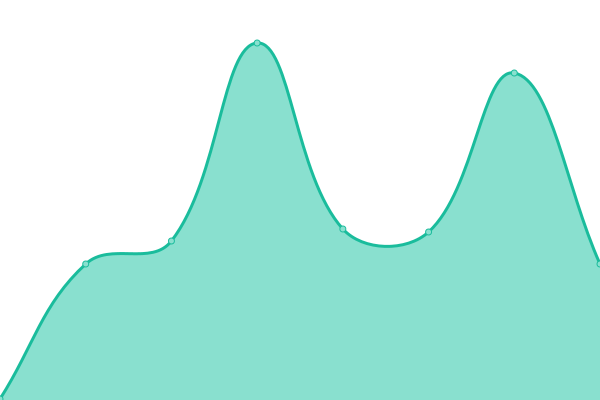
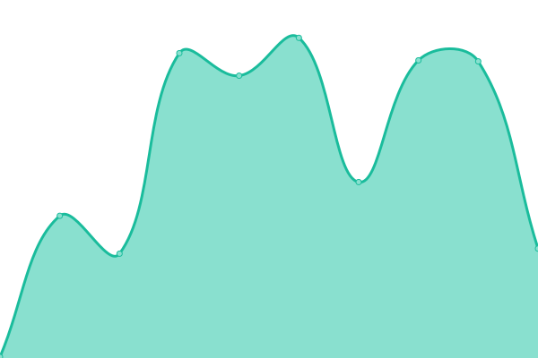

# [📈 Live Status](https://bradp.github.io/uptime): <!--live status--> **🟩 All systems operational**

This repository contains the open-source uptime monitor and status page for [Brad Parbs](https://brad.party), powered by [Upptime](https://github.com/upptime/upptime).

With [Upptime](https://upptime.js.org), you can get your own unlimited and free uptime monitor and status page, powered entirely by a GitHub repository. We use [Issues](https://github.com/bradp/uptime/issues) as incident reports, [Actions](https://github.com/bradp/uptime/actions) as uptime monitors, and [Pages](https://bradp.github.io/uptime) for the status page.

<!--start: status pages-->
<!-- This summary is generated by Upptime (https://github.com/upptime/upptime) -->
<!-- Do not edit this manually, your changes will be overwritten -->
<!-- prettier-ignore -->
| URL | Status | History | Response Time | Uptime |
| --- | ------ | ------- | ------------- | ------ |
|  [BradParbs.com](https://bradparbs.com) | 🟩 Up | [brad-parbs-com.yml](https://github.com/bradp/uptime/commits/HEAD/history/brad-parbs-com.yml) | 

 133ms
     
 | 

<a href="https://status.brrad.com/history/brad-parbs-com">100.00%</a>
    

|  [brrad.com](https://brrad.com/w) | 🟩 Up | [brrad-com.yml](https://github.com/bradp/uptime/commits/HEAD/history/brrad-com.yml) | 

 135ms
     
 | 

<a href="https://status.brrad.com/history/brrad-com">100.00%</a>
    

|  [IsItSnowingInMilwaukee.com](https://isitsnowinginmilwaukee.com) | 🟩 Up | [is-it-snowing-in-milwaukee-com.yml](https://github.com/bradp/uptime/commits/HEAD/history/is-it-snowing-in-milwaukee-com.yml) | 

 132ms
     
 | 

<a href="https://status.brrad.com/history/is-it-snowing-in-milwaukee-com">100.00%</a>
    

|  [gifsb.in](https://gifsb.in) | 🟩 Up | [gifsb-in.yml](https://github.com/bradp/uptime/commits/HEAD/history/gifsb-in.yml) | 

 110ms
     
 | 

<a href="https://status.brrad.com/history/gifsb-in">100.00%</a>
    

|  [sax.cat](https://sax.cat) | 🟩 Up | [sax-cat.yml](https://github.com/bradp/uptime/commits/HEAD/history/sax-cat.yml) | 

 189ms
     
 | 

<a href="https://status.brrad.com/history/sax-cat">100.00%</a>
    

|  [butts.tech](https://butts.tech) | 🟩 Up | [butts-tech.yml](https://github.com/bradp/uptime/commits/HEAD/history/butts-tech.yml) | 

 156ms
     
 | 

<a href="https://status.brrad.com/history/butts-tech">100.00%</a>
    

|  [fauxio](https://faux.io) | 🟩 Up | [fauxio.yml](https://github.com/bradp/uptime/commits/HEAD/history/fauxio.yml) | 

 90ms
     
 | 

<a href="https://status.brrad.com/history/fauxio">100.00%</a>
    

|  [brad.cash](https://brad.cash) | 🟩 Up | [brad-cash.yml](https://github.com/bradp/uptime/commits/HEAD/history/brad-cash.yml) | 

 125ms
     
 | 

<a href="https://status.brrad.com/history/brad-cash">99.84%</a>
    

|  [pears.cloud](https://pears.cloud) | 🟩 Up | [pears-cloud.yml](https://github.com/bradp/uptime/commits/HEAD/history/pears-cloud.yml) | 

 183ms
     
 | 

<a href="https://status.brrad.com/history/pears-cloud">100.00%</a>
    

|  [horror.watch](https://horror.watch) | 🟩 Up | [horror-watch.yml](https://github.com/bradp/uptime/commits/HEAD/history/horror-watch.yml) | 

 138ms
     
 | 

<a href="https://status.brrad.com/history/horror-watch">100.00%</a>
    

<!--end: status pages-->

[**Visit our status website →**](https://bradp.github.io/uptime)

## 📄 License

- Powered by: [Upptime](https://github.com/upptime/upptime)
- Code: [MIT](./LICENSE) © [Brad Parbs](https://brad.party)
- Data in the `./history` directory: [Open Database License](https://opendatacommons.org/licenses/odbl/1-0/)
