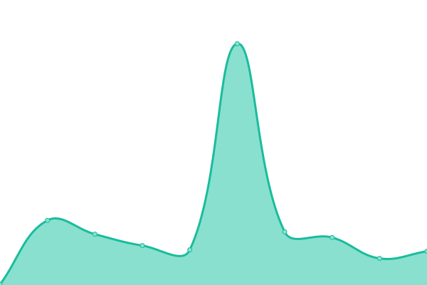
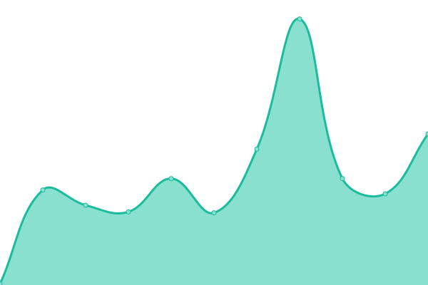
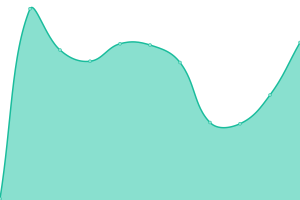

# [📈 Live Status](https://bradp.github.io/uptime): <!--live status--> **🟩 All systems operational**

This repository contains the open-source uptime monitor and status page for [Brad Parbs](https://brad.party), powered by [Upptime](https://github.com/upptime/upptime).

With [Upptime](https://upptime.js.org), you can get your own unlimited and free uptime monitor and status page, powered entirely by a GitHub repository. We use [Issues](https://github.com/bradp/uptime/issues) as incident reports, [Actions](https://github.com/bradp/uptime/actions) as uptime monitors, and [Pages](https://bradp.github.io/uptime) for the status page.

<!--start: status pages-->
<!-- This summary is generated by Upptime (https://github.com/upptime/upptime) -->
<!-- Do not edit this manually, your changes will be overwritten -->

| URL                                                              | Status | History                                                                                                                         | Response Time                                                                                       | Uptime                                                                                                                                                                                                                                                 |
| ---------------------------------------------------------------- | ------ | ------------------------------------------------------------------------------------------------------------------------------- | --------------------------------------------------------------------------------------------------- | ------------------------------------------------------------------------------------------------------------------------------------------------------------------------------------------------------------------------------------------------------ |
| [BradParbs.com](https://bradparbs.com)                           | 🟩 Up  | [brad-parbs-com.yml](https://github.com/bradp/uptime/commits/master/history/brad-parbs-com.yml)                                 |  143ms                 |                                  |
| [brrad.com](https://brrad.com/w)                                 | 🟩 Up  | [brrad-com.yml](https://github.com/bradp/uptime/commits/master/history/brrad-com.yml)                                           |  121ms                      |                                            |
| [IsItSnowingInMilwaukee.com](https://isitsnowinginmilwaukee.com) | 🟩 Up  | [is-it-snowing-in-milwaukee-com.yml](https://github.com/bradp/uptime/commits/master/history/is-it-snowing-in-milwaukee-com.yml) |  167ms |  |
| [gifsb.in](https://gifsb.in)                                     | 🟩 Up  | [gifsb-in.yml](https://github.com/bradp/uptime/commits/master/history/gifsb-in.yml)                                             |  86ms                        |                                              |
| [sax.cat](https://sax.cat)                                       | 🟩 Up  | [sax-cat.yml](https://github.com/bradp/uptime/commits/master/history/sax-cat.yml)                                               |  143ms                        |                                                |
| [butts.tech](https://butts.tech)                                 | 🟩 Up  | [butts-tech.yml](https://github.com/bradp/uptime/commits/master/history/butts-tech.yml)                                         |  97ms                      |                                          |
| [fauxio](https://faux.io)                                        | 🟩 Up  | [fauxio.yml](https://github.com/bradp/uptime/commits/master/history/fauxio.yml)                                                 |  123ms                         |                                                  |
| [brad.cash](https://brad.cash)                                   | 🟩 Up  | [brad-cash.yml](https://github.com/bradp/uptime/commits/master/history/brad-cash.yml)                                           |  65ms                       |                                            |

<!--end: status pages-->

[**Visit our status website →**](https://bradp.github.io/uptime)

## 📄 License

- Powered by: [Upptime](https://github.com/upptime/upptime)
- Code: [MIT](./LICENSE) © [Brad Parbs](https://brad.party)
- Data in the `./history` directory: [Open Database License](https://opendatacommons.org/licenses/odbl/1-0/)
