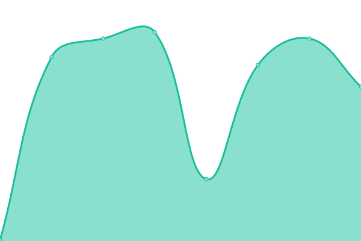
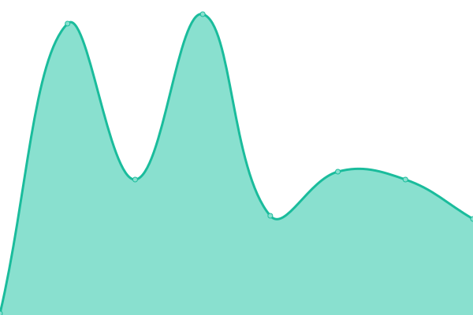

# [📈 Live Status](https://bradp.github.io/uptime): <!--live status--> **🟧 Partial outage**

This repository contains the open-source uptime monitor and status page for [Brad Parbs](https://brad.party), powered by [Upptime](https://github.com/upptime/upptime).

With [Upptime](https://upptime.js.org), you can get your own unlimited and free uptime monitor and status page, powered entirely by a GitHub repository. We use [Issues](https://github.com/bradp/uptime/issues) as incident reports, [Actions](https://github.com/bradp/uptime/actions) as uptime monitors, and [Pages](https://bradp.github.io/uptime) for the status page.

<!--start: status pages-->
<!-- This summary is generated by Upptime (https://github.com/upptime/upptime) -->
<!-- Do not edit this manually, your changes will be overwritten -->
<!-- prettier-ignore -->
| URL | Status | History | Response Time | Uptime |
| --- | ------ | ------- | ------------- | ------ |
|  [bradparbs.com](https://bradparbs.com) | 🟩 Up | [bradparbs-com.yml](https://github.com/bradp/uptime/commits/HEAD/history/bradparbs-com.yml) | 

 132ms
     
 | 

<a href="https://status.brrad.com/history/bradparbs-com">100.00%</a>
    

|  [brad.party (redirect)](https://brad.party) | 🟩 Up | [brad-party-redirect.yml](https://github.com/bradp/uptime/commits/HEAD/history/brad-party-redirect.yml) | 

 387ms
     
 | 

<a href="https://status.brrad.com/history/brad-party-redirect">100.00%</a>
    

|  [parbs.org (redirect)](https://parbs.org) | 🟩 Up | [parbs-org-redirect.yml](https://github.com/bradp/uptime/commits/HEAD/history/parbs-org-redirect.yml) | 

 212ms
     
 | 

<a href="https://status.brrad.com/history/parbs-org-redirect">100.00%</a>
    

|  [parbs.me (redirect)](https://parbs.me) | 🟩 Up | [parbs-me-redirect.yml](https://github.com/bradp/uptime/commits/HEAD/history/parbs-me-redirect.yml) | 

 158ms
     
 | 

<a href="https://status.brrad.com/history/parbs-me-redirect">100.00%</a>
    

|  [parbs.co (redirect)](https://parbs.co) | 🟩 Up | [parbs-co-redirect.yml](https://github.com/bradp/uptime/commits/HEAD/history/parbs-co-redirect.yml) | 

 124ms
     
 | 

<a href="https://status.brrad.com/history/parbs-co-redirect">100.00%</a>
    

|  [brad.cash](https://brad.cash) | 🟩 Up | [brad-cash.yml](https://github.com/bradp/uptime/commits/HEAD/history/brad-cash.yml) | 

 380ms
     
 | 

<a href="https://status.brrad.com/history/brad-cash">100.00%</a>
    

|  [brrad.com (redirect)](https://brrad.com) | 🟩 Up | [brrad-com-redirect.yml](https://github.com/bradp/uptime/commits/HEAD/history/brrad-com-redirect.yml) | 

 119ms
     
 | 

<a href="https://status.brrad.com/history/brrad-com-redirect">100.00%</a>
    

|  [brrad.com/w](https://brrad.com/w) | 🟩 Up | [brrad-com-w.yml](https://github.com/bradp/uptime/commits/HEAD/history/brrad-com-w.yml) | 

 104ms
     
 | 

<a href="https://status.brrad.com/history/brrad-com-w">100.00%</a>
    

|  [status.brrad.com](https://status.brrad.com) | 🟩 Up | [status-brrad-com.yml](https://github.com/bradp/uptime/commits/HEAD/history/status-brrad-com.yml) | 

 120ms
     
 | 

<a href="https://status.brrad.com/history/status-brrad-com">100.00%</a>
    

|  [butts.tech](https://butts.tech) | 🟩 Up | [butts-tech.yml](https://github.com/bradp/uptime/commits/HEAD/history/butts-tech.yml) | 

 115ms
     
 | 

<a href="https://status.brrad.com/history/butts-tech">100.00%</a>
    

|  [gifsb.in](https://gifsb.in) | 🟩 Up | [gifsb-in.yml](https://github.com/bradp/uptime/commits/HEAD/history/gifsb-in.yml) | 

 173ms
     
 | 

<a href="https://status.brrad.com/history/gifsb-in">100.00%</a>
    

|  [horror.watch](https://horror.watch) | 🟩 Up | [horror-watch.yml](https://github.com/bradp/uptime/commits/HEAD/history/horror-watch.yml) | 

 295ms
     
 | 

<a href="https://status.brrad.com/history/horror-watch">100.00%</a>
    

|  [isitsnowinginmilwaukee.com](https://isitsnowinginmilwaukee.com) | 🟩 Up | [isitsnowinginmilwaukee-com.yml](https://github.com/bradp/uptime/commits/HEAD/history/isitsnowinginmilwaukee-com.yml) | 

 139ms
     
 | 

<a href="https://status.brrad.com/history/isitsnowinginmilwaukee-com">100.00%</a>
    

|  [sax.cat](https://sax.cat) | 🟩 Up | [sax-cat.yml](https://github.com/bradp/uptime/commits/HEAD/history/sax-cat.yml) | 

 214ms
     
 | 

<a href="https://status.brrad.com/history/sax-cat">100.00%</a>
    

|  [pears.cloud](https://pears.cloud) | 🟩 Up | [pears-cloud.yml](https://github.com/bradp/uptime/commits/HEAD/history/pears-cloud.yml) | 

 108ms
     
 | 

<a href="https://status.brrad.com/history/pears-cloud">100.00%</a>
    

|  [fauxio](https://faux.io) | 🟩 Up | [fauxio.yml](https://github.com/bradp/uptime/commits/HEAD/history/fauxio.yml) | 

 113ms
     
 | 

<a href="https://status.brrad.com/history/fauxio">100.00%</a>
    

|  [last.sh](https://last.sh) | 🟩 Up | [last-sh.yml](https://github.com/bradp/uptime/commits/HEAD/history/last-sh.yml) | 

 171ms
     
 | 

<a href="https://status.brrad.com/history/last-sh">100.00%</a>
    

|  [mouse.rip](https://mouse.rip) | 🟩 Up | [mouse-rip.yml](https://github.com/bradp/uptime/commits/HEAD/history/mouse-rip.yml) | 

 507ms
     
 | 

<a href="https://status.brrad.com/history/mouse-rip">100.00%</a>
    

|  [api.mouse.rip](https://mouse.rip/favicon.ico) | 🟩 Up | [api-mouse-rip.yml](https://github.com/bradp/uptime/commits/HEAD/history/api-mouse-rip.yml) | 

 29ms
     
 | 

<a href="https://status.brrad.com/history/api-mouse-rip">100.00%</a>
    

|  [guide.mouse.rip](https://guide.mouse.rip) | 🟩 Up | [guide-mouse-rip.yml](https://github.com/bradp/uptime/commits/HEAD/history/guide-mouse-rip.yml) | 

 517ms
     
 | 

<a href="https://status.brrad.com/history/guide-mouse-rip">100.00%</a>
    

|  [guide-preview.mouse.rip](https://guide-preview.mouse.rip) | 🟩 Up | [guide-preview-mouse-rip.yml](https://github.com/bradp/uptime/commits/HEAD/history/guide-preview-mouse-rip.yml) | 

 370ms
     
 | 

<a href="https://status.brrad.com/history/guide-preview-mouse-rip">100.00%</a>
    

|  [items.mouse.rip](https://items.mouse.rip) | 🟩 Up | [items-mouse-rip.yml](https://github.com/bradp/uptime/commits/HEAD/history/items-mouse-rip.yml) | 

 453ms
     
 | 

<a href="https://status.brrad.com/history/items-mouse-rip">100.00%</a>
    

|  [mousehunt.org (redirect)](https://mousehunt.org) | 🟩 Up | [mousehunt-org-redirect.yml](https://github.com/bradp/uptime/commits/HEAD/history/mousehunt-org-redirect.yml) | 

 276ms
     
 | 

<a href="https://status.brrad.com/history/mousehunt-org-redirect">100.00%</a>
    

|  [mouse.place (redirect)](https://mouse.place) | 🟥 Down | [mouse-place-redirect.yml](https://github.com/bradp/uptime/commits/HEAD/history/mouse-place-redirect.yml) | 

 466ms
     
 | 

<a href="https://status.brrad.com/history/mouse-place-redirect">74.91%</a>
    

<!--end: status pages-->

[**Visit our status website →**](https://bradp.github.io/uptime)

## 📄 License

- Powered by: [Upptime](https://github.com/upptime/upptime)
- Code: [MIT](./LICENSE) © [Brad Parbs](https://brad.party)
- Data in the `./history` directory: [Open Database License](https://opendatacommons.org/licenses/odbl/1-0/)
